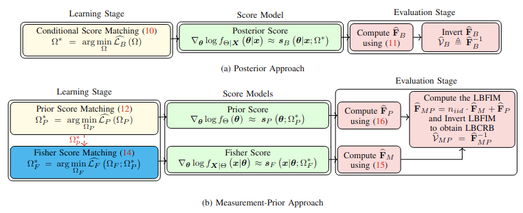
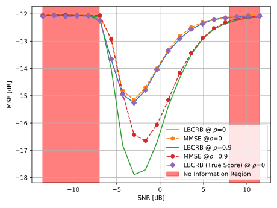
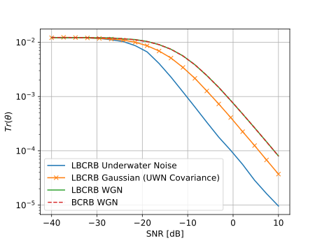

# Learned Bayesian Cram\'er Rao Bound

## Introduction

This repository contains the code for the paper "Learned Bayesian Cram\'er Rao Bound".


## Abstract
The Bayesian Cramér-Rao bound (BCRB) is a crucial tool in signal processing for assessing the fundamental limitations of any estimation problem as well as benchmarking within a Bayesian frameworks. However, the BCRB cannot be computed without full knowledge of the prior and the measurement distributions. In this work, we propose a fully learned Bayesian Cramér-Rao bound (LBCRB) that learns both the prior and the measurement distributions. Specifically, we suggest two approaches to obtain the LBCRB: the Posterior Approach and the Measurement-Prior Approach. The Posterior Approach provides a simple method to obtain the LBCRB, whereas the Measurement-Prior Approach enables us to incorporate domain knowledge to improve the sample complexity and {interpretability}. To achieve this, we introduce a Physics-encoded score neural network which enables us to easily incorporate such domain knowledge into a neural network. We {study the learning} errors of the two suggested approaches theoretically, and  validate them numerically. We demonstrate the two approaches on several signal processing examples, including a linear measurement problem with unknown mixing and Gaussian noise covariance matrices, frequency estimation, and quantized measurement. In addition, we test our approach on a nonlinear signal processing problem of frequency estimation with real-world underwater ambient noise.


## Installation and Usage

The code is written in Python 3.11. To install the required packages, run
```bash
  pip install -r requirements.txt
```

To train the score neural network for LBCRB, run

```bash
  python train_score_nn.py
```

To evaluate the LBCRB, run

```bash
  python evaluate.py
```
Example of the evaluation results can be found in the `results` folder and run configuration file in the `configs` folder.

In depth analysis is provided in the `analysis` folder, however it reuqire to run the training first as well as Weight and biases account.

## Results

Here are two result on real-world problems: (i) frequency estimation with real-world underwater ambient noise; and (ii) one-bit quantization with correlated noise.

 

LBCRB for the linear Gaussian model with 1-bit quantized measurement in two case:(i) with correlated noise ($\rho=0.9$); and (ii) uncorrelated noises ($\rho=0$). 
The two no-information region are marked in red. "True score" stands for evaluating the LBCRB without any approximation error.



Bounds on frequency estimation with real ocean underwater noise (UWN) vs. Gaussian noises. The LBCRB for white Gaussian noise (WGN) coincides with the analytical BCRB for WGN.
From more details about the results, please check our paper (https://arxiv.org/abs/2502.00724).

## Citation

If you find this code useful, please consider citing our paper

```
@misc{habi2025learnedbayesiancramerraobound,
      title={Learned {B}ayesian {C}ram\'er-{R}ao Bound for {U}nknown {M}easurement {M}odels {U}sing {S}core {N}eural {N}etworks}, 
      author={Hai Victor Habi and Hagit Messer and Yoram Bresler},
      year={2025},
      eprint={2502.00724},
      archivePrefix={arXiv},
      primaryClass={eess.SP},
      url={https://arxiv.org/abs/2502.00724}, 
}
```